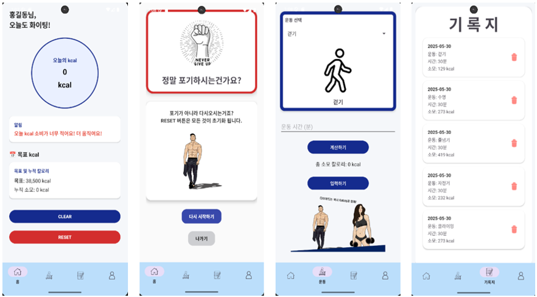
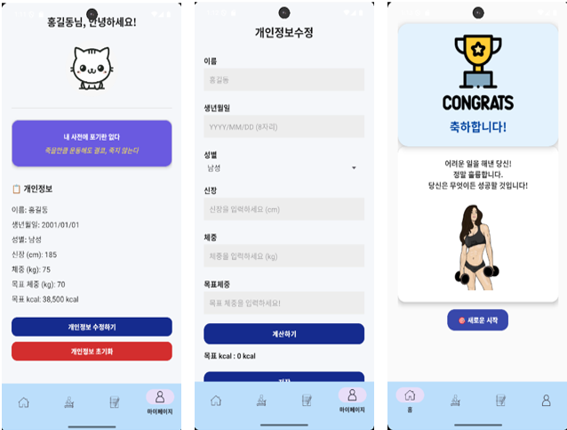

# 🔥 체중 감량 유산소 다이어트 앱

### 📌 앱 아이콘

**앱 이름 - KalLog**

Kcal (칼로리) + Log (기록) 을 합쳐 운동한 칼로리를 기록한다는 의미

---

## 📱 프로젝트 개요

본 앱은 유산소 운동을 통한 체중 감량 보조를 목적으로 개발된 Android 애플리케이션입니다.  
사용자의 정보를 기반으로 kcal 목표 소모량을 설정하고, 일일 운동량에 따라 현재 소모량을 기록 및 피드백해줍니다.

> ❗ 본 앱은 식단 관리는 포함하지 않으며, 유산소 운동만으로 체중 감량을 보조하는 데 초점을 둡니다.

- **설치 환경:** Android 8.0 이상  
- **타겟 사용자:** 체중 감량을 원하는 일반인, 헬스 초보자 등

---

## 📺 시연 영상

### ▶️ 요약 영상 (3분)

  
👉 [3분 요약 영상 바로가기](https://www.youtube.com/watch?v=kjeKgzfzS5k)

---

### ▶️ 전체 버전 (7분)

  
👉 [전체 발표 영상 바로가기](https://youtu.be/BZ2arlXIY5A)

---

## 🧠 주요 기능

### 1. 사용자 정보 기반 맞춤 목표 설정
- 이름, 생년월일, 성별, 키, 현재 체중, 목표 체중 입력  
- 자동으로 기초대사량(BMR) 계산 (Mifflin-St Jeor 식 활용)  
- 감량 목표 체중과 기간을 기반으로 일일 kcal 목표 소모량 설정

### 2. 운동 후 kcal 소모량 입력
- 운동 종류, 시간, 체중 입력 시 자동으로 kcal 계산  
- 계산 방식: `소모 칼로리 = MET × 체중(kg) × 시간(h)`  
- 운동 예시: 걷기, 자전거, 달리기, 수영 등

### 3. 일일 / 누적 소모 kcal 피드백
- 홈 화면에 "오늘의 kcal", "누적 kcal" 표시  
- 1,500kcal 이상일 경우 목표 달성 메시지  
- 목표 도달 시 CLEAR 화면, 부족할 경우 응원 메시지 출력

### 4. 개인정보 수정 및 초기화
- 마이페이지에서 정보 확인 및 수정 가능  
- "개인정보 초기화" 버튼 클릭 시 SharedPreferences 초기화

### 5. 자정 자동 초기화 기능
- AlarmManager를 이용해 매일 00시에 todayKcal 자동 리셋

---

## 🧮 kcal 계산 기준 및 출처

### 1. 일일 kcal 목표 설정
- 기초대사량(BMR) 계산 공식:  
  - 남성: `10 × 체중(kg) + 6.25 × 키(cm) - 5 × 나이 + 5`  
  - 여성: `10 × 체중(kg) + 6.25 × 키(cm) - 5 × 나이 - 161`

- 감량 공식: `1kg 감량 = 약 7,700 kcal 소모 필요`  
- 예시:  
  - 5kg 감량 → 38,500 kcal  
  - 기간 30일 → 하루 약 1,283 kcal 소모 목표

📎 출처: [Wikipedia - Mifflin-St Jeor](https://en.wikipedia.org/wiki/Mifflin-St_Jeor_equation)

---

### 2. 운동 kcal 계산에 사용된 MET 기준

- MET (Metabolic Equivalent of Task): 활동 강도 단위  
  - 걷기: 3.8 MET  
  - 자전거 타기: 7.5 MET  
  - 조깅: 8.0~10.0 MET

📎 출처:  
- [Harvard Medical School](https://www.health.harvard.edu/diet-and-weight-loss/calories-burned-in-30-minutes-of-leisure-and-routine-activities)  
- [Compendium of Physical Activities](https://sites.google.com/site/compendiumofphysicalactivities/)

---

## ⚙️ 기술 스택

- Kotlin (Android SDK)
- Android Jetpack: Navigation Component, SharedPreferences
- MPAndroidChart (그래프 시각화)
- AlarmManager (자정 자동 초기화)
- ConstraintLayout, CardView 기반 UI

> Kotlin 1.9.x / MPAndroidChart v3.1.0

---

## 🚀 향후 개선 방향

- 식단 입력 및 영양소 분석 기능 추가
- 사용자 간 운동량 공유 기능
- Firebase 또는 Room DB를 활용한 클라우드 백업

---

## 🖼️ 주요 화면 예시

  
*홈 화면 및 운동 입력 예시*

  
*운동 기록 및 목표 결과 화면*

---

## 👨‍💻 개발자

**최정우 – 한성대학교 안드로이드 프로그래밍 기말 프로젝트**  
🔗 [https://github.com/jwoochoi2001/KalLog](https://github.com/jwoochoi2001/KalLog)
